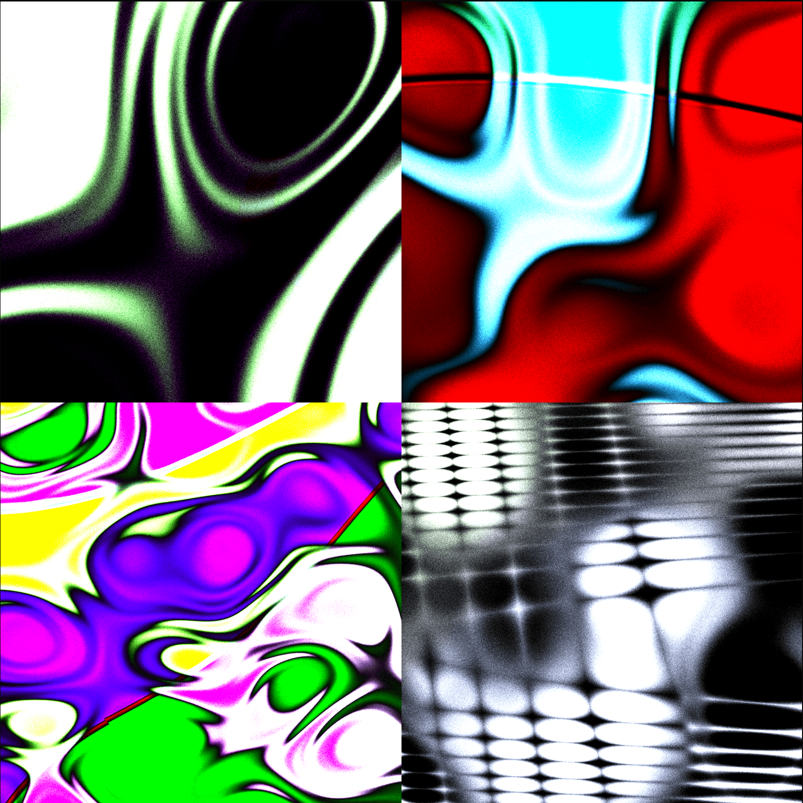

# Liquid Shape Distortions 🌀

Create psychedelic animations in real-time in the browser.

(P)art of your next trip.

Webgl shader animation created using liquid motion, distorted shapes, shadows, and light.

## Overview

Use this to create:
- Animated backgrounds for music videos
- Concert / rave posters
- Stylized assets for creative projects

## Features

- **Real-time rendering** - real-time edits to the animation in the browser
- **Randomization** - Generate unique patterns with a single click
- **Extensive controls** - Fine-tune the animation parameters and canvas size 
- **Export options** - Save your creations as images or videos
- **Completely free** - No paywalls, no premium options
- **Open source** - MIT licensed for personal and commercial use

## Controls

| Control | Keyboard | Description |
|---------|----------|-------------|
| 🎲 | [R] | Randomize all inputs |
| ⏯️ | [Space] | Pause/play the animation |
| 📷 | [S] | Save a screenshot image |
| 🎥 | [V] | Start/stop video export |
| 🔊 | [M] | Toggle background music |

Additional keyboard shortcuts:
- [Tab] - Refresh pattern with a new random seed
- [T] - Restart animation from time = 0

## Technical Details

This project is built using:
- WebGL shaders for high-performance rendering
- Vanilla JavaScript for logic and interactivity
- HTML5 Canvas for display
- CSS for styling
- dat.GUI for the control interface
- MP4 muxer for video encoding and export

The fragment shader uses:
- 3D simplex noise and fractal Brownian motion for organic patterns / liquid movement
- Seed-based randomization for unique visuals
- Real-time shader effects (bloom, saturation, grain)

## Performance Notes

The WebGL shaders used in this project can be resource-intensive. For optimal performance:
- Close unnecessary browser tabs
- Ensure your device has adequate GPU capabilities
- Reduce the canvas size if experiencing lag
- Ensure your device is not in battery-saving mode
