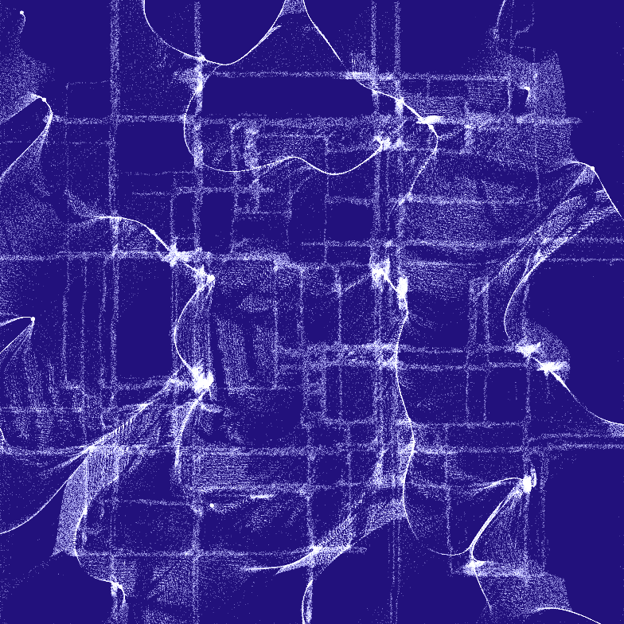

# Particular Drift

Turn images into flowing particle animations! This javascript / WebGL tool creates particle animations from any image, with particles that dynamically respond to edge detection and flow fields.

## Features

- Upload any image and convert it to a dynamic particle animation
- Real-time parameter controls for customizing the animation
- Edge detection with dynamic particle attraction
- Perlin noise-based flow fields for organic movement
- Export animations as images or videos
- Fully client-side processing - no server uploads required
- MIT licensed and free for both personal and commercial use

## Technical Details

The animation combines several techniques:

- **Edge Detection** using Sobel filters
- **Perlin / Simplex Noise** for generating organic flow fields (2D or 3D)
- **WebGL** for high-performance GPU-accelerated rendering
- **GLSL Shaders** for particle physics and rendering
- **Transform Feedback** for efficient particle system updates

## Parameters

Users can control various aspects of the animation:

- **Particle Speed**: Controls how fast particles move through the scene
- **Attraction Strength**: Determines how strongly particles are drawn to detected edges
- **Particle Opacity**: Sets the transparency of individual particles
- **Particle Size**: Adjusts the size of each particle
- **Particle Count**: Sets the total number of particles in the system
- **Edge Threshold**: Controls the sensitivity of edge detection
- **Flow Field Scale**: Complexity of the flow field 
- **Noise Type**: Select 2D perlin noise or 3D simplex noise for the flow field movement
- **Color Palette**: Choose from preset color combinations or customize your own
- **Background Color**: Set the background color
- **Particle Color**: Set the color of the particles

## Browser Requirements

- WebGL2 support
- Required WebGL extensions:
  - EXT_color_buffer_float
  - OES_texture_float_linear

## Performance Considerations

The animation is computationally intensive due to the large number of particles and real-time processing. Performance may vary based on:
- Your device's GPU capabilities
- Screen resolution
- Number of particles
- Size of the input image

If you experience lag:
- Reduce the particle count
- Close unnecessary browser tabs
- Ensure your device is not in power-saving mode
- Try a smaller input image

## Video Export

The tool uses the WebCodecs API and mp4-muxer for video export. If video export doesn't work in your browser:
- Try using Chrome or Edge, which have better support for the WebCodecs API
- Consider using an external screen recording tool like OBS Studio