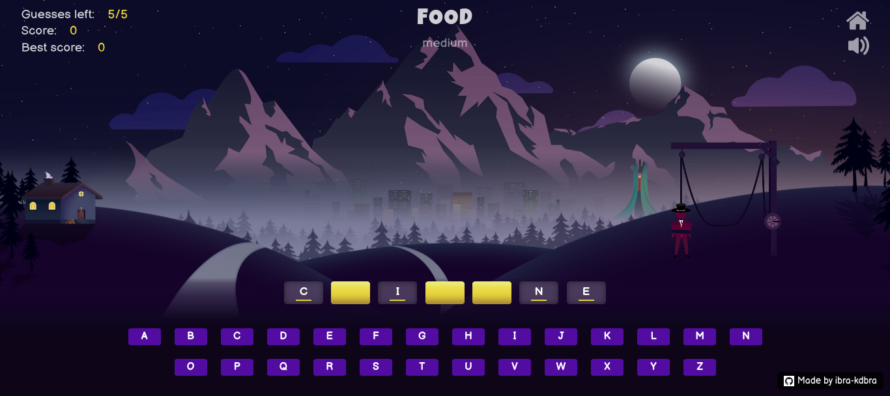

# Hangman

 

 

## About the project

Hangman is a word game in which one player has to guess a word that the other player (the computer in this case) has thought of, by guessing the letters in it. Every time the player guesses a wrong letter, the rope that's tightening the man will get pulled by a tiny bit, until it gets completely pulled and the man is hanged. The player has to make the right guesses before the rope gets completely pulled to win the game.

The game is responsive to different window sizes, built with HTML, CSS3, and vanilla javascript.

 

# Project Files Description

### **`index.html`**
The entry point of the project.

---

### **`main.js`**
The main JavaScript file that handles:
- Game logic.
- Animations.
- Fetching data from APIs used in the project.

---

### **`rope.js`**
This file contains the logic for all canvas animations used to calculate and display the hanging animation of a person. It implements a **simple particle system** to simulate the motion of a rope using physics.

#### **Key Features:**
- Utilizes **Hooke's Law** with a spring-damper system to simulate tension:
  \[
  F = -\beta v - kx
  \]
  Where:
  - **x**: Vector displacement from the spring's equilibrium position.
  - **k**: Spring constant (tightness of the spring).
  - **β**: Coefficient of damping.
  - **v**: Relative velocity between two points connected by the spring.

#### **Parameters:**
You can tweak the following parameters (declared at the beginning of the file) to achieve different animation effects:
- **Mass** of particles.
- **Density** of the rope.
- **Gravity** acting on the system.
- Spring constants (**k**, **β**) and initial displacement (**x**).

---

### **`loader.js`**
Handles the loading animation while preloading all media assets (images and sounds) using [PreloadJS](https://createjs.com/preloadjs).

--- 

This layout ensures modularity and efficiency for handling animations, logic, and asset loading in the project.

