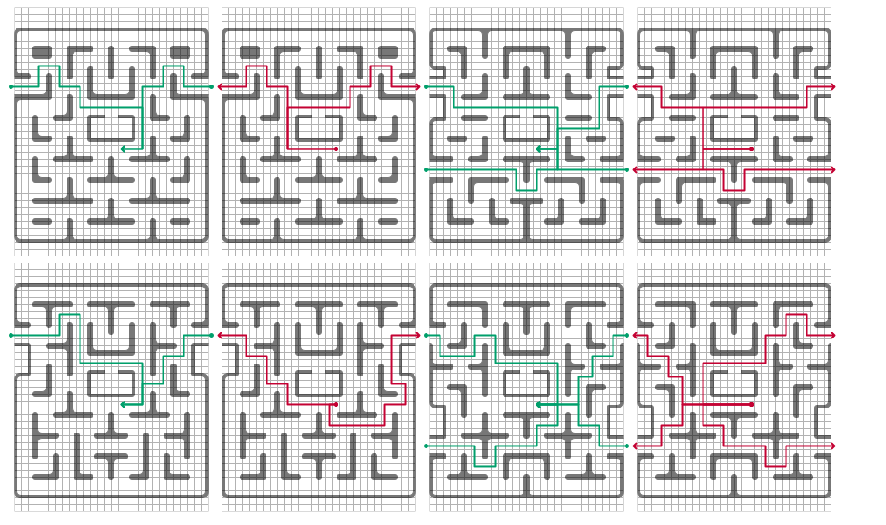
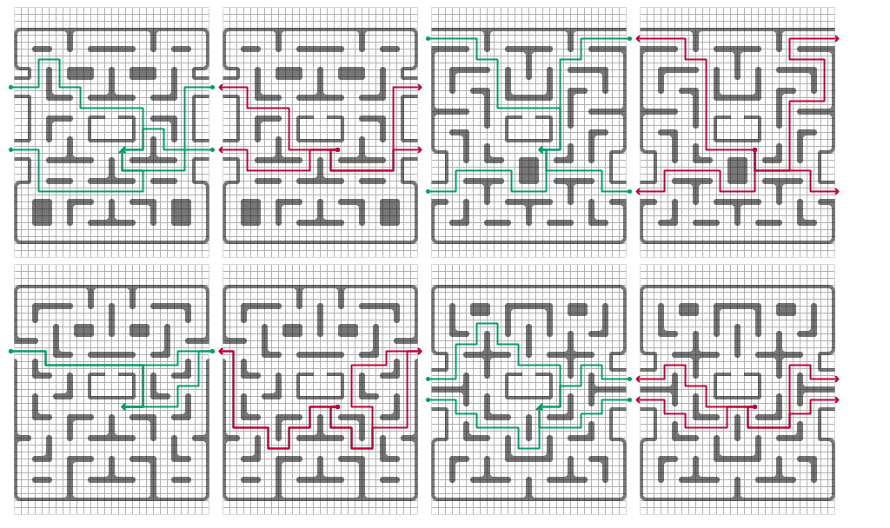

# Pac-Man Fruit Paths

A fruit takes a random path around a maze.  It begins by traveling to the center of the maze from any of a given set of preset entrance paths.  It continues around the ghost pen once and exits the maze from another given set of preset paths for exiting.
    
## Original Maps

Entrances are shown in **green**.  Exits are shown in **red**.

## Generated Maps

Random fruit paths are created for a procedurally generated map using Dijkstra's Algorithm.  This was used in place of the minimum distance direction algorithm used by the ghosts to ensure that the fruit would never get stuck in a loop.  

This method runs Dijkstra's algorithm twice for every map: for entrances and exits, respectively.  The single source for the entrance graph starts at tile (15,20), removing the node at (14,20) from the graph to prevent the fruit from reversing direction before rounding the ghost pen. Once the entrance graph is built, it is used to determine the paths to each of the tunnel openings as entrances, which are then reversed so that they start from the tunnel and end at the center.

Similarly, the exit graphs start at tile (16,20), removing the node at (17,20) from the graph to prevent the fruit from reversing direction after rounding the ghost pen.  Once the exit graph is built, it is used to determine the paths to each of the tunnel openings as exits.

