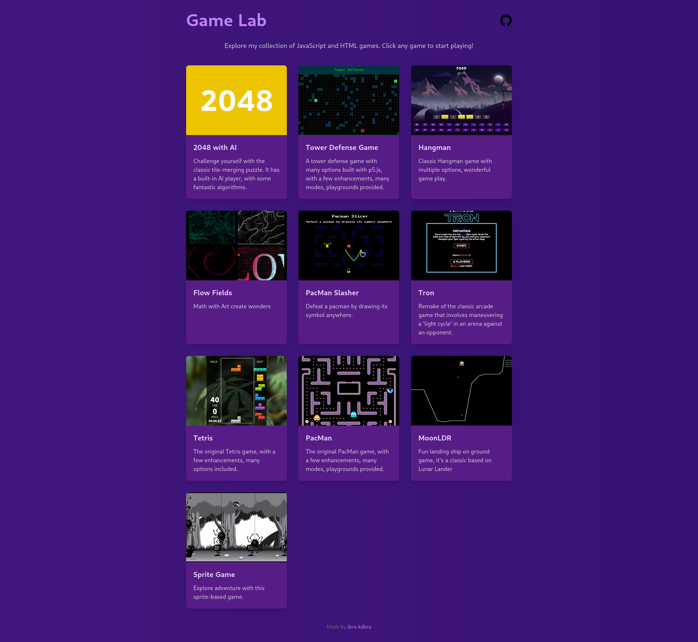

# JavaScript Game Collection



<div style="text-align: center;">
  <a href="LICENSE">
    
  </a>
  <a href="https://github.com/ibra-kdbra/JS_game_collections/graphs/contributors">
    
  </a>
  <a href="https://github.com/ibra-kdbra/JS_game_collections/stargazers" target="_blank">
    
  </a>
  <a href="https://github.com/ibra-kdbra/JS_game_collections/network/members" target="_blank">
    
  </a>
  <a href="https://ibra-kdbra.github.io/JS_game_collections/" target="_blank">
    
  </a>
</div>


<details>
<summary>Table of Contents</summary>

- [JavaScript Game Collection](#javascript-game-collection)
  - [Overview](#overview)
  - [Why Choose Vanilla JavaScript and HTML5 Canvas?](#why-choose-vanilla-javascript-and-html5-canvas)
  - [Getting Started](#getting-started)
  - [Game Development Process](#game-development-process)
  - [Some Featured Games](#some-featured-games)
</details>

## Overview

This repository showcases a collection of interactive games developed exclusively with **Vanilla JavaScript**, **HTML5**, and **CSS3**. By focusing on these core web technologies, the project emphasizes a deep understanding of fundamental concepts, efficient performance, and meticulous control over every aspect of the codebase.

## Why Choose Vanilla JavaScript and HTML5 Canvas?

Developing games with Vanilla JavaScript and the HTML5 `<canvas>` element offers several advantages:

1. **Deep Understanding of Core Technologies**: Building games from scratch without external libraries or frameworks fosters a comprehensive grasp of JavaScript and browser APIs. This foundational knowledge is crucial for any software engineer aiming to excel in web development.

2. **Enhanced Performance**: By eliminating the overhead associated with external libraries, games can achieve optimized performance, leading to smoother animations and more responsive gameplay.

3. **Complete Code Control**: Direct manipulation of the codebase allows for tailored solutions and fine-tuned optimizations, ensuring that the game's architecture aligns perfectly with its design requirements.

## Getting Started

To explore and run the games in this collection:

1. **Clone the Repository**:
   ```bash
   git clone https://github.com/ibra-kdbra/JS_game_collections.git
   ```

2. **Navigate to the Project Directory**:
   ```bash
   cd JS_game_collections
   ```
3. **Open the Index File:**
     Launch index.html in your preferred web browser to access the game selection menu.

[Back to top](#javascript-game-collection)

## Game Development Process
Each game in this collection is developed following a structured approach:

1. Conceptualization and Design: 
Define the game's mechanics, objectives, and user interactions. Create wireframes or sketches to visualize the game's layout and flow.

1. Setting Up the Development Environment: 
Structure the project directory, ensuring a clean separation of HTML, CSS, and JavaScript files. Utilize semantic HTML5 elements and organize assets systematically.

1. Implementing the Game Logic:
Employ algorithms and data structures to manage game states, handle user inputs, and control game dynamics.

1. Rendering Graphics with HTML5 Canvas, or build with good js logic and css art:   
   - Drawing Shapes and Images: Use canvas APIs to render game elements.
   - Animating Game Objects: Implement game loops and animation frames for smooth motion.
   - Collision Detection: Develop algorithms to detect and respond to interactions between game entities.
   - Try the best pattern for your game.

    For a comprehensive guide on using the canvas element, refer to the [MDN Web Docs on Canvas API](https://developer.mozilla.org/en-US/docs/Web/API/Canvas_API).

2. Styling with Pure CSS:
   - Designing Responsive Layouts: Ensure the game adapts to various screen sizes and orientations.
   - Applying Thematic Styles: Use CSS to create immersive themes that align with the game's concept.
   - Incorporating Animations and Transitions: Add subtle animations to improve interactivity and feedback.
  
3. Testing and Optimization: 
   Rigorously test each game to identify and fix bugs. Optimize code and assets to ensure efficient performance across different devices and browsers.(The finishing touches)

[Back to top](#javascript-game-collection)

## Some Featured Games

- [2048 Clone](https://ibra-kdbra.github.io/JS_game_collections/2048/index.html): A sliding tile puzzle game implementing algorithmic logic with an AI mind playing instead of you. 

- [Hangman](https://ibra-kdbra.github.io/JS_game_collections/Hangman/index.html): Classic word-guessing game demonstrating string manipulation and event handling. 

- [Tetris](https://ibra-kdbra.github.io/JS_game_collections/Tetris/index.html): The timeless block-stacking game showcasing array manipulation and collision detection. 

- [PacMan](https://ibra-kdbra.github.io/JS_game_collections/PacMan/index.html): A rendition of the iconic arcade game, highlighting pathfinding algorithms and sprite animations.
  
- [Tower Defense](https://ibra-kdbra.github.io/JS_game_collections/TowerDefense/index.html): A tower defense game where players control towers to defend against waves of enemies.

[Back to top](#javascript-game-collection)