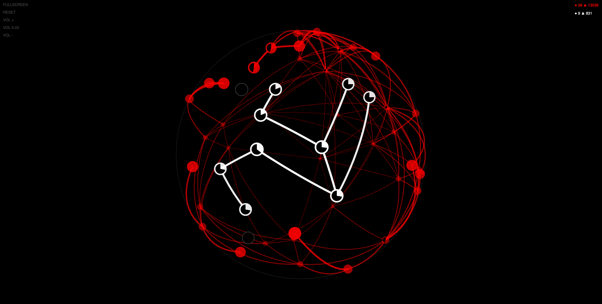
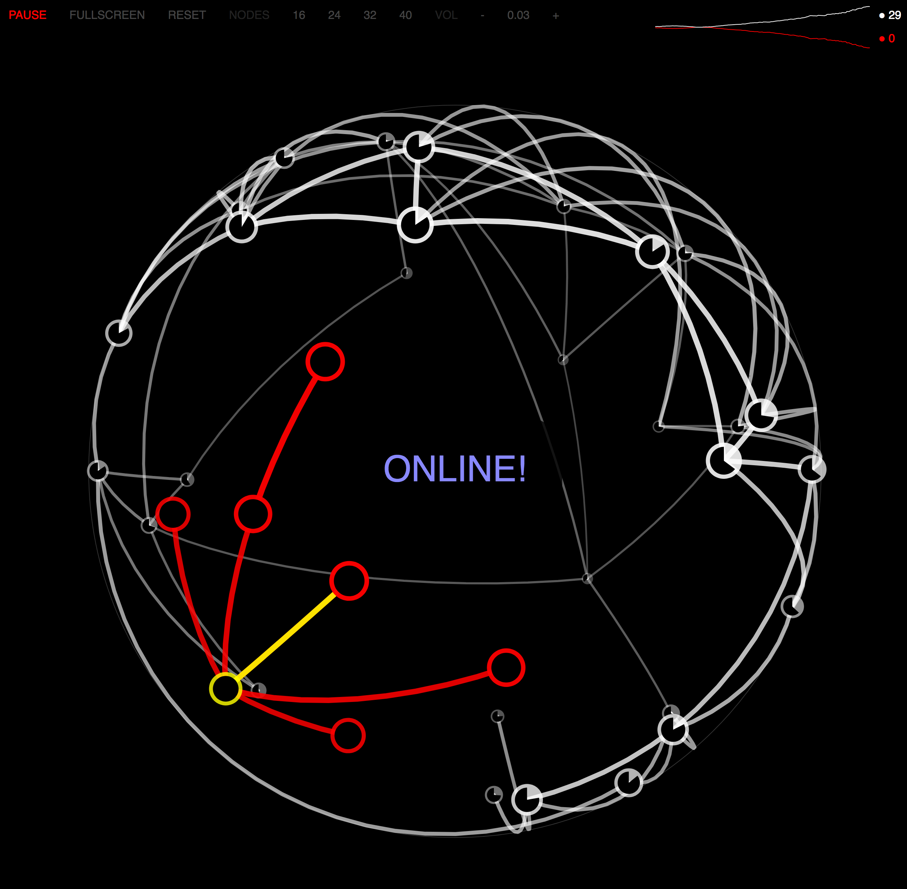
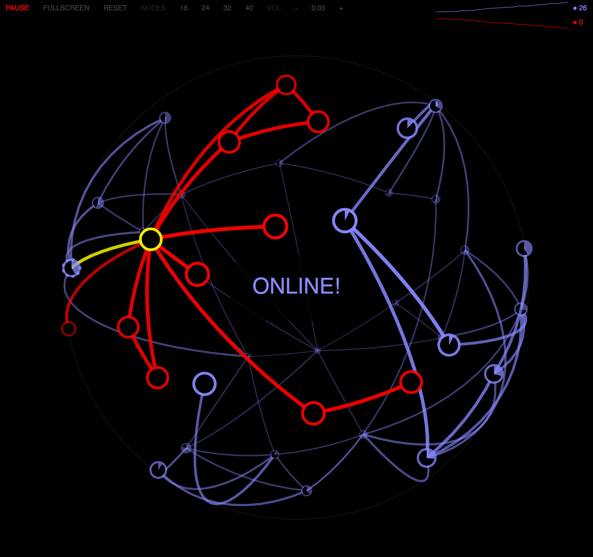
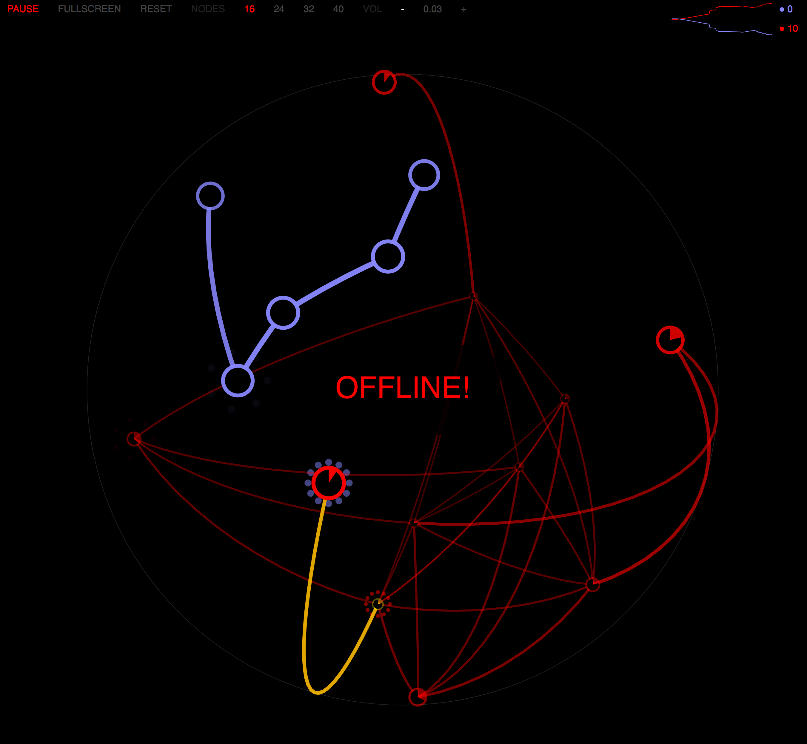
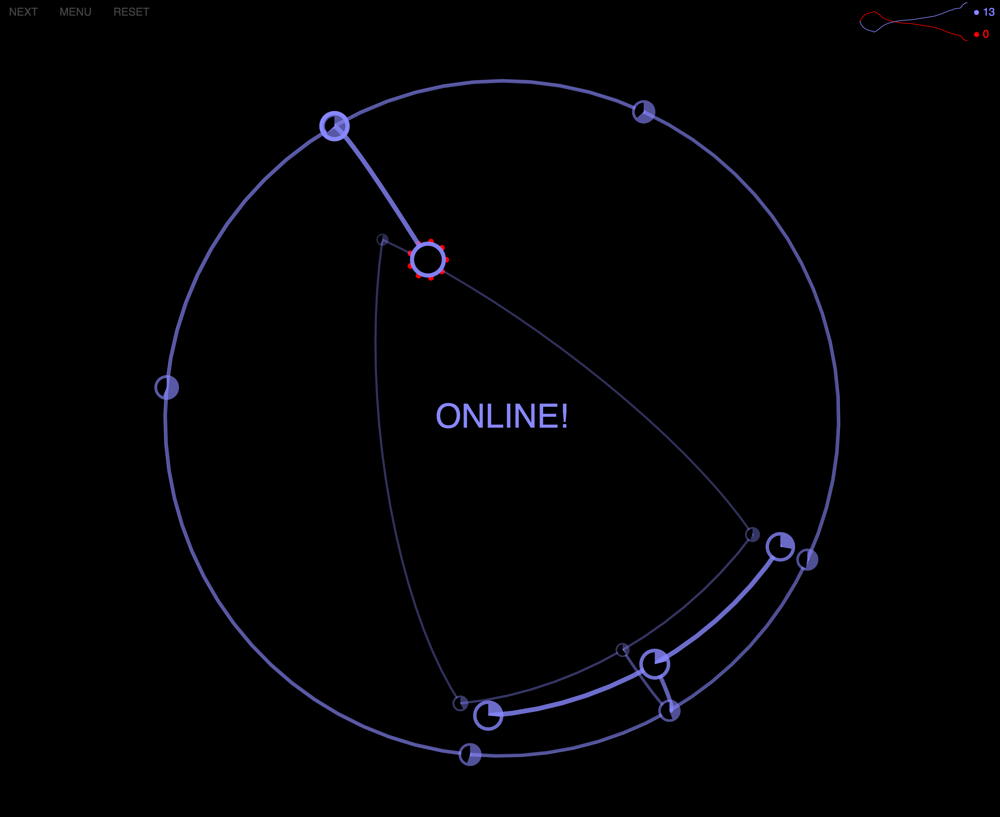
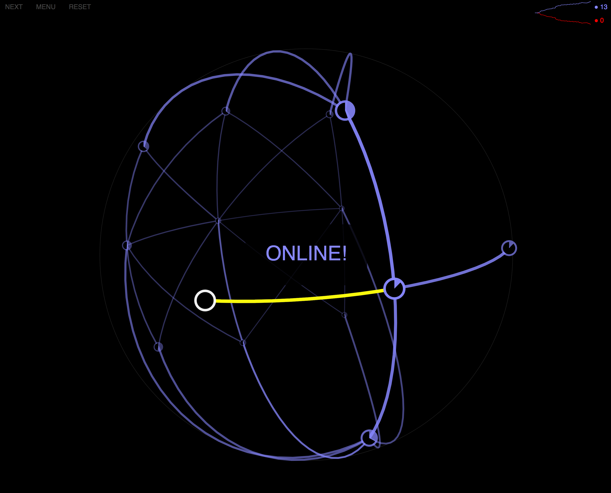

# Wahdatio - The State of Unity

## Overview

**Wahdatio** is a profound 3D strategy game that embodies the concept of unity and interconnectedness. The name draws from Arabic "Wahdat" (وَحْدَة) meaning "unity" or "oneness" - a fundamental concept in Islamic and Sufi philosophy - combined with the Latin "-tio" suffix denoting a state of being.

## Gameplay

Wahdatio is a strategic battle game played on the surface of a 3D sphere where players control nodes (dots) to fight against an AI opponent in a virus-themed battle for control.

### Core Mechanics

- **3D Spherical Battlefield**: Navigate and interact with nodes positioned on a rotating sphere
- **Node Control**: Capture and control nodes by sending "processes" between them
- **Strategic Combat**: Attack enemy nodes while defending your own territory
- **Resource Management**: Balance unit distribution across your network
- **Dynamic Audio**: Procedurally generated sound effects using Web Audio API

### Game Features

- **Multiple Levels**: From tutorial missions to challenging scenarios
- **AI Opponent**: Intelligent bot that adapts its strategy
- **Visual Effects**: Spark animations for attacks and interactions
- **Real-time Strategy**: Fast-paced decision making and resource allocation
- **Immersive Audio**: Custom synthesized musical instruments and sound effects

## Technical Implementation

- **Pure JavaScript**: No external frameworks or libraries
- **SVG Graphics**: Vector-based 3D-like rendering on 2D canvas
- **Web Audio API**: Procedural audio generation
- **Quaternion Mathematics**: 3D rotations and spatial calculations
- **Modular Architecture**: Organized class-based structure

## Game Gallery

### Screenshots

|  |  |
|:---:|:---:|
|  |  |
|  |  |

## Philosophy

The game's name and mechanics reflect the philosophical concept of "Wahdat al-Wujud" (Unity of Being) - the idea that all existence is interconnected and unified at its core. Players must achieve strategic unity across their network while disrupting the opponent's cohesion.

## How to Play

1. **Rotation**: Click and drag anywhere on the sphere to rotate the view
2. **Selection**: Click on your blue nodes to select them
3. **Attack**: Drag from your node to an enemy node to send processes
4. **Strategy**: Manage your resources and capture territory strategically
5. **Victory**: Eliminate all enemy nodes to win

## Controls

- **Mouse Drag**: Rotate the sphere view
- **Click + Drag**: Send processes between nodes
- **Space/Escape**: Pause game
- **R**: Reset current level

## Development

The game is built using vanilla JavaScript with advanced mathematical concepts including:
- 3D vector mathematics
- Quaternion rotations
- Procedural audio synthesis
- Real-time graphics rendering

---

*"In the unity of existence, every connection matters, every node counts."*
